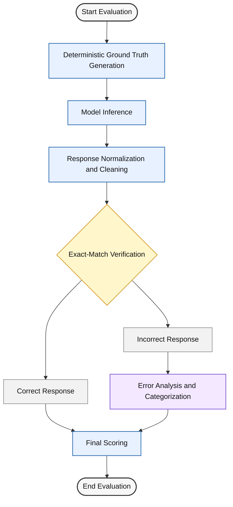

## Evaluation Pipeline

To clearly illustrate the benchmarking methodology, we include a process figure that summarizes the full evaluation pipeline. The figure highlights how each stage contributes to a comprehensive, fair, and insightful assessment of model performance on geotemporal reasoning tasks.

This benchmarking pipeline begins with deterministic ground-truth generation using formal calendar and time zone rules. Each prompt is then evaluated through standardized model inference, followed by response normalization to remove formatting artifacts. Exact-match verification ensures strict and reproducible scoring, while error analysis provides additional insight into common failure modes. Together, these stages deliver a comprehensive evaluation framework that is fair across models and informative for understanding both strengths and weaknesses.
